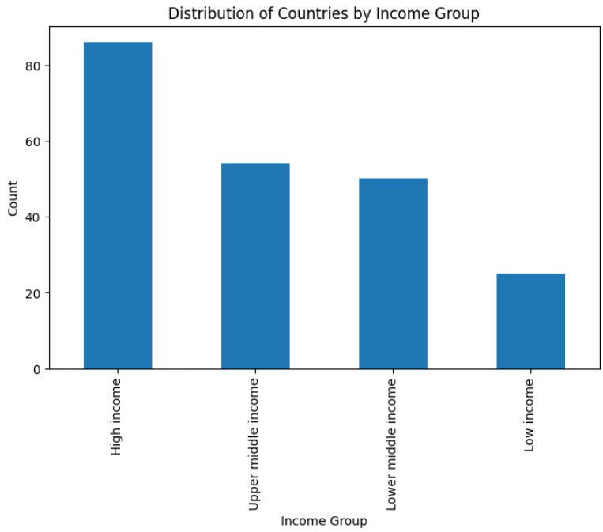

# Prodigy Infotech Internship – Task 01  
## Data Visualization using Bar Chart

### 📌 Task Objective
Create a bar chart or histogram to visualize the distribution of a categorical or continuous variable such as age, gender, or region in a population dataset.

---

### 📊 Dataset Used
- **File Name:** Metadata_country.csv  
- **Source:** Prodigy Infotech (Official GitHub Dataset)
- **Key Columns:**
  - Region
  - IncomeGroup
  - Country Code

---

### 🛠 Tools & Technologies
- Python
- Pandas
- Matplotlib
- Google Colab

---

### 📈 Visualization Performed
- **Bar Chart** showing the **distribution of countries by region**
- This helps understand how countries are spread across different global regions.

---

### 🧪 Steps Performed
1. Loaded the dataset using Pandas
2. Cleaned missing values from the `Region` column
3. Counted the number of countries per region
4. Visualized the distribution using a bar chart
5. Added proper labels and title for clarity

---

### 📷 Output


---

### ▶️ How to Run
```bash
pip install pandas matplotlib
